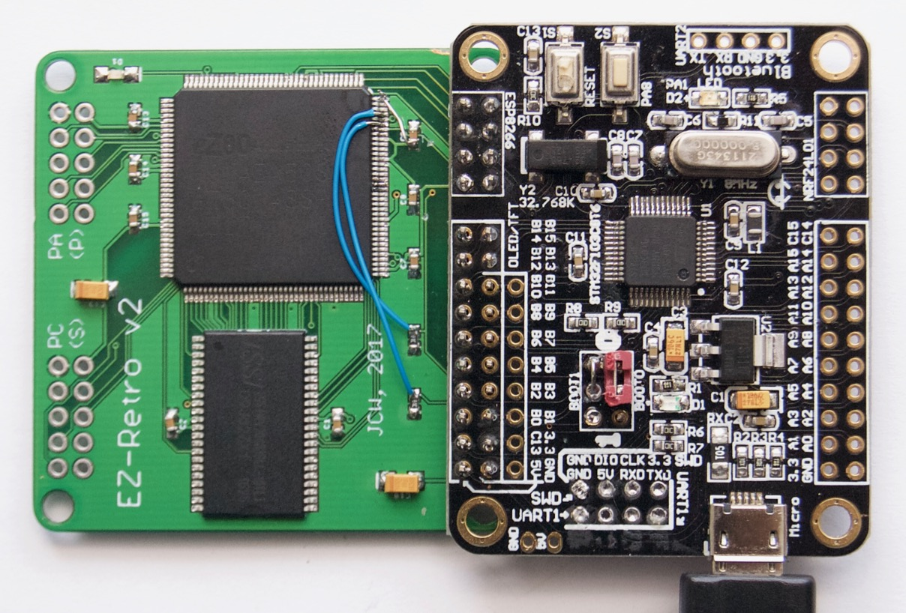

Z80 & CP/M retro-computing with an EZ80 plus STM32F103
<!--more-->

# EZ Retro

----

#### Status 2017-04

* v1 = works with CP/M and disk images on µSD card, 512K RAM
* v2 = EZ80 and µSD card access ok, UART/SPI/SRAM unknown
* Design files are in the
  [ezr](https://github.com/jeelabs/embello/tree/master/explore/1608-forth/ezr)
  area of the [Embello](https://github.com/jeelabs/embello) GitHub repository
