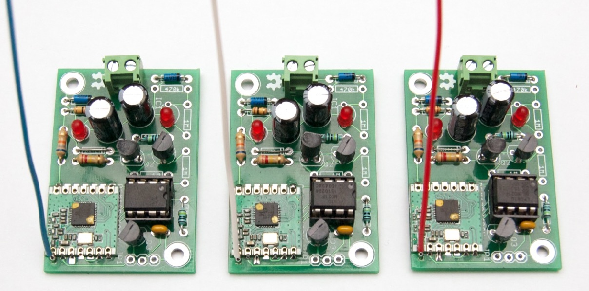

Periodically send a wireless data packet
using energy harvested from a Current Transformer
<!--more-->

# Micro Power Snitch

----

#### Status 2015-05

* Final build with custom PCB, works as intended
* Design files are in the
  [mps](https://github.com/jeelabs/embello/tree/master/projects/mps) area of the
  [Embello](https://github.com/jeelabs/embello) GitHub repository
* Depending on PCB rev, Q2 and others may need special orientation:

