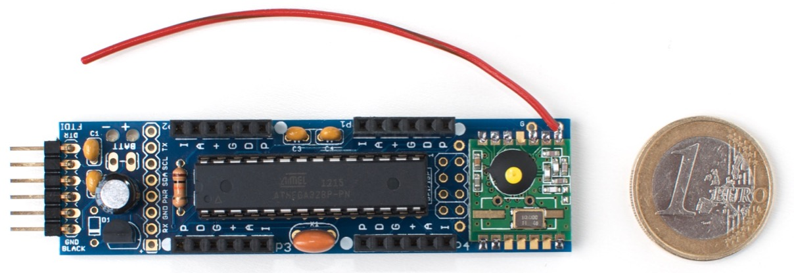

A low-power Arduino'ish board with wireless, plus an elaborate library with
examples
<!--more-->

# JeeNode

----

{}

#### Status 2017

* The _JeeNode_ (ATmega328 + [RFM12/RFM69](rf12-69)) is available [in the
  shop](https://www.digitalsmarties.net/products/jeenode)
* For all models (also JeeLink, JN Micro, etc) - see the [hardware](hardware)
  page
* The JeeLib library for use with the Arduino IDE is described [here](jeelib)
* Numerous examples projects are listed on the [examples](examples) page
* All the source code is in the [jcw/jeelib](https://github.com/jcw/jeelib)
  repository on GitHub
* For (somewhat ageing) docs about JeeLib, see this [Doxygen
  area](https://jeelabs.org/pub/docs/jeelib/)
