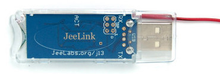

{}
The pinouts of most of the boards listed here can be found on
[this wiki page](https://jeelabs.net/projects/hardware/wiki/Pinouts).  {}

## JeeNode v6

* [Homepage](https://jeelabs.net/projects/hardware/wiki/JeeNode) - [In the
  shop](https://www.digitalsmarties.net/products/jeenode)

This is the original JeeNode, with an ATmega328 µC (just like an Arduino Uno)
and either an RFM69CW or the older RFM12B radio module. It works with 3.3V
voltage levels and is designed for ultra low-power battery-powered use:

Uploading and debugging takes place via the 6-pin _FTDI header_ on the left, and
requires an USB-BUB or equivalent to hook up to the Arduino IDE on your
computer.

This is a kit with easy-to-solder through-hole parts.
The radio module is placed on top and "tacked down" with solder pads. An antenna
wire of approx 8 cm is needed for the radio, which operates at 868 MHz in Europe
or 915 MHz in the US.

## JeeNode SMD

* [Homepage](https://jeelabs.net/projects/hardware/wiki/JeeNode_SMD) - [In the
  shop](https://www.digitalsmarties.net/products/jeenode-smd)

The JeeNode SMD is a pre-assembled variant of the JeeNode v6 kit, using SMD
components. It has the same size and pinout, but offers a few extra I/O pins:

## JeeNode USB

* [Homepage](https://jeelabs.net/projects/hardware/wiki/JeeNode_USB) - [In the
  shop](https://www.digitalsmarties.net/products/jeenode-usb)

The JeeNod USB is like a JeeNode SMD, but with an additional built-in
USB-to-Serial FTDI adapter.  It also adds a reset button, a blue LED, and
a LiPo charge circuit:

## JeeLink

* [Homepage](https://jeelabs.net/projects/hardware/wiki/JeeLink) - [In the
  shop](https://www.digitalsmarties.net/products/jeelink)

The JeeLink is designed as central wireless node for remote JeeNodes and other
devices transmitting on the same 868 or 915 MHz frequency in a compatible
format. It plugs directly into a USB jack and includes a 2 MB dataflash memory
for unattended logging as well as an accurate 10 ppm crystal for keeping time:

## JeeNode Micro

* [Homepage](https://jeelabs.net/projects/hardware/wiki/JeeNode_Micro) - [In
  the shop](https://www.digitalsmarties.net/products/jeenode-micro)

The JeeNode Micro is the smaller cousin of the JeeNode. It has an ATtiny84 µC
instead of an ATmega328, with much more limited memory, weaker hardware
peripherals, and fewer I/O pins, but still makes a very nice and small remote
sensor nodes if your requirements are more limited:

Programming these boards Micro requires an ISP programmer, and even debugging
via a serial console requires much more effort. The ATtiny84 is not supported by
default in the Arduino IDE, but there are add-ons to fill in this gap.

The JeeNode Micro also comes in a version with on-board boost regulator,
allowing it to run off a single AA or AAA battery.

## LED Node

* [Homepage](https://jeelabs.net/projects/hardware/wiki/LED_Node) - [In the
  shop](https://www.digitalsmarties.net/products/led-node-v2)

The LED Node is a JeeNode with three high-current 12V LED drivers, for use with
popular RGB strips (or a couple of monochrome strips). The layout is designed to
match those strips, so that the board can be fitted next to the strips:

This is a through-hole kit, apart from three (fairly large) SMD MPSFETs. There
is a single 6-pin JeePort on the right. The FTDI header is in the middle of the
board, and there is a screw terminal on the left to supply the high-power 12V
for the LED strips.

## Add-on JeePlugs

* [Homepage](https://jeelabs.net/projects/hardware/wiki) -
  [In the shop](https://www.digitalsmarties.net/collections/all/plugs)

Most JeeNodes have one to four 6-pin "JeePorts": a convention which allows
connecting a large variety of additional hardware devices via digital, analog,
or bit-banged I2C connections:

Since I2C is a bus, multiple I2C-enabled plugs can be connected to each port,
for virtually unlimited expansion. Usually this is done in a daisy-chain
fashion.

The homepage and shop links above describe dozens of small JeePlug interface
boards for a wide variety of uses, with JeeNodes or other µC boards.
