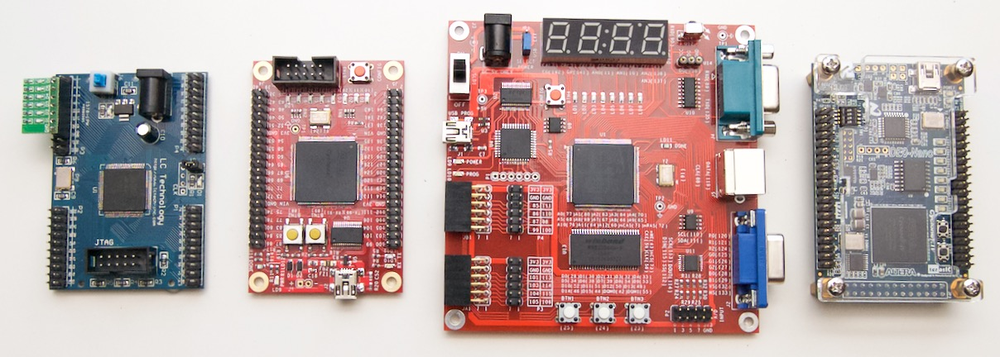

All sorts of experiments with FPGAs on a range of low-cost boards
<!--more-->

## Weblog posts

* [A diversion into FPGAs](https://jeelabs.org/2015/12/09/a-diversion-into-fpgas/) - Dec 2015
    * [Move over, John von Neumann](https://jeelabs.org/book/1550a/)
    * [Building a MultiComp-based Z80](https://jeelabs.org/book/1550b/)
    * [The language(s) of FPGAs](https://jeelabs.org/book/1550c/)
    * [TFoC – A wide performance range](https://jeelabs.org/book/1550d/)
* [Forth on Nandland Go Board](https://jeelabs.org/2016/06/forth-on-nandland-go-board/) - Jun 2016
* [TFoC: FPGA & Forth = VGA](https://jeelabs.org/2016/07/tfoc-fpga--forth--vga/) - Jul 2016
* [CPLDs and FPGAs](https://jeelabs.org/2016/08/cplds-and-fpgas/) - Aug 2016
* [VGA in Verilog](https://jeelabs.org/2016/08/vga-in-verilog/) - Aug 2016
* [Sweep, staircase, and blanking](https://jeelabs.org/2016/08/sweep-staircase-and-blanking/) - Aug 2016
* [PMOD connectors](https://jeelabs.org/2016/08/pmod-connectors/) - Aug 2016
* [Let's build (half a) UART](https://jeelabs.org/2016/08/lets-build-half-a-uart/) - Aug 2016
* [I never had an Intel 8080](https://jeelabs.org/2016/09/i-never-had-an-intel-8080/) - Sep 2016
* [Running a simulated FPGA](https://jeelabs.org/2016/09/running-a-simulated-fpga/) - Sep 2016
* [Diving deep into SPI](https://jeelabs.org/2016/09/diving-deep-into-spi/) - Sep 2016
* [PDP-8/L & DF32 disk on FPGA](https://jeelabs.org/2016/10/pdp-8/l--df32-disk-on-fpga/) - Oct 2016
* [Debugging an FPGA via a µC](https://jeelabs.org/2016/10/debugging-an-fpga-via-a-µc/) - Oct 2016
* [Composite video from FPGA](https://jeelabs.org/2016/11/composite-video-from-fpga/) - Nov 2016
* [Tying into SDRAM](https://jeelabs.org/2016/11/tying-into-sdram/) - Nov 2016
* [So many memories](https://jeelabs.org/2016/11/so-many-memories/) - Nov 2016
* [A fast µC to FPGA bus](https://jeelabs.org/2016/11/a-fast-µc-to-fpga-bus/) - Nov 2016
