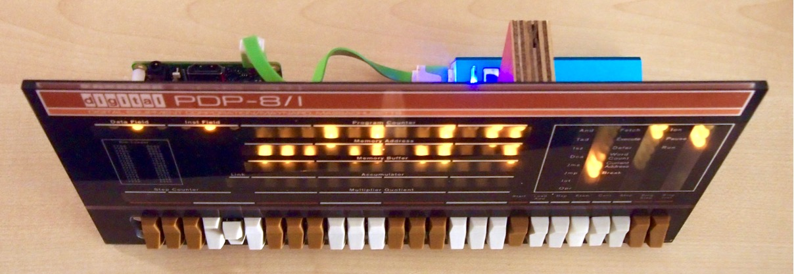

Re-implementing the venerable PDP minicomputers with modern hardware
<!--more-->

## Weblog posts

* [The PDP-8, half a century ago](https://jeelabs.org/2016/02/the-pdp-8-half-a-century-ago/) - Feb 2016
    * [Inside the PDP-8 hardware](https://jeelabs.org/article/1607a/)
    * [Computer peripherals in 1965](https://jeelabs.org/article/1607b/)
    * [Hey PDP-8, meet Raspberry Pi!](https://jeelabs.org/article/1607c/)
    * [Some amazing software feats](https://jeelabs.org/article/1607d/)
* [TFoC - PDP-8 in 256 lines of C](https://jeelabs.org/2016/09/tfoc---pdp-8-in-256-lines-of-c/) - Sep 2016
* [STM32F103 emulating a PDP-8](https://jeelabs.org/2016/10/stm32f103-emulating-a-pdp-8/) - Oct 2016
* [PDP-8/L & DF32 disk on FPGA](https://jeelabs.org/2016/10/pdp-8/l--df32-disk-on-fpga/) - Oct 2016
