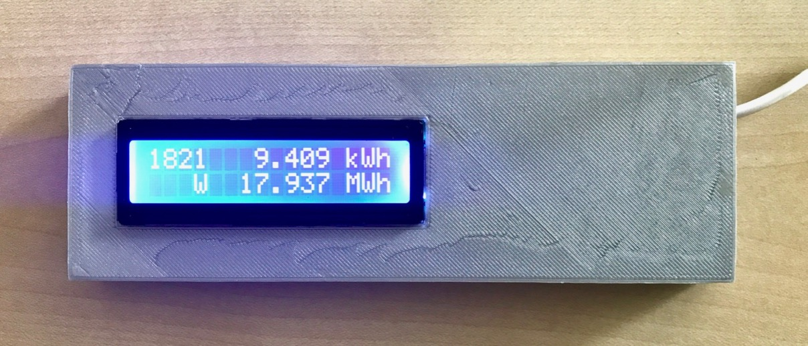

Read out an SMA 5000TL solar inverter via Bluetooth
<!--more-->

# SMA Solar

----

#### Status 2017-09

* Hand-wired build with custom case, works as intended
* Design files are in the
  [sma](https://github.com/jeelabs/embello/tree/master/projects/sma) area of the
  [Embello](https://github.com/jeelabs/embello) GitHub repository
